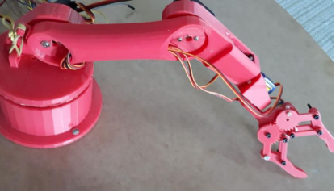
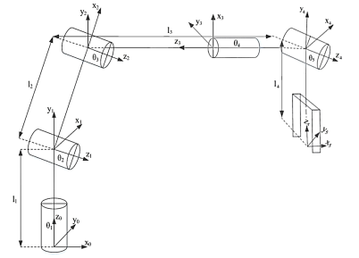
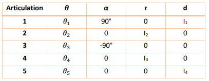
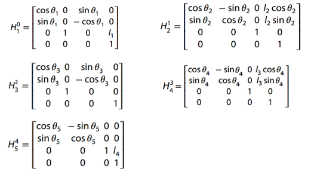
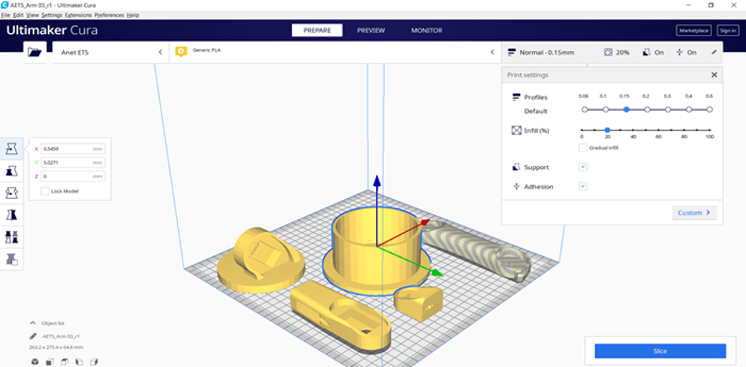
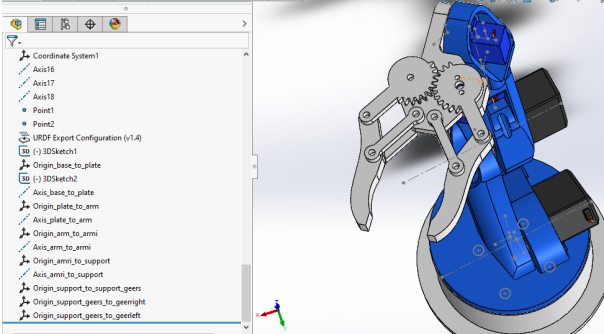
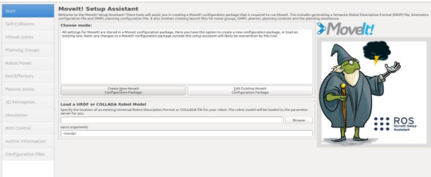
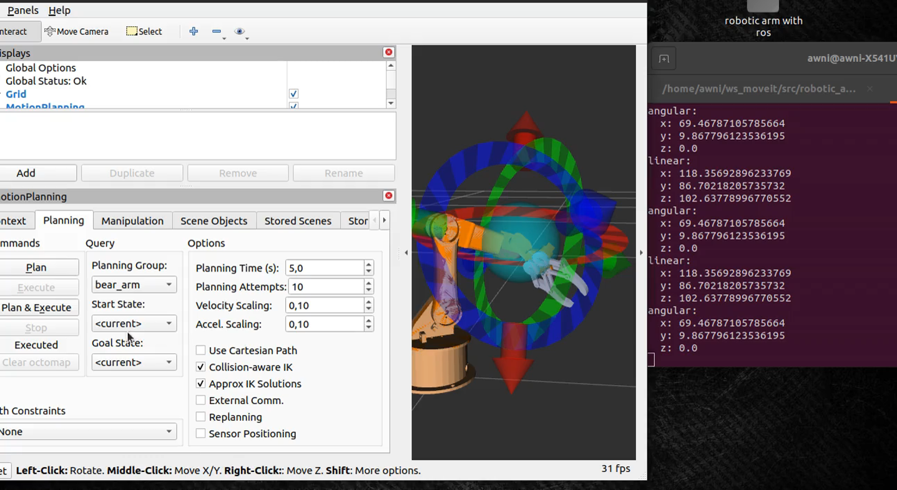

# Robotic_Arm
 

# 
As part of my end-of-year project, I chose to work on this theme,
which we found quite interesting, as it offers us an excellent opportunity to
implement all the skills I have acquired up to this point in our training in robotics and mechatronics and image processing/industrial vision.
I am also interested in the industrial context of this project, which offers us an opportunity to manipulate robots in their exact operating environments and to take all these conditions into account from the the design phase.
# Theoretical study
Kinematic modeling and establishing coordinates is a key point in order to harmonize the manipulator robot with its control device.
Subsequently, the Denavit-Hartenberg (DH) design is carried out where homogeneous matrices of pairs
Individual kinematics are used to define the transformation of the coordinate.
The DH coordinate frames are shown in Fig. 2 which includes the provision of the
joints, links and orientations of the manipulator.
In the figure, the four segments of the manipulator are labeled I1, I2, I3, and I4 and their lengths are 16
cm, 44 cm, 37 cm and 25 cm respectively.
The arm includes five rotation joints which are labeled as J1, J2, J3, J4 and J5.
These five joints work simultaneously to grip an object in a three-way workspace.
dimensions and thus achieve an efficient grip.

#  

#  
To analyze the inverse kinematics, the DH parameters are presented in Table 1.
With :
* 𝜽 is the necessary rotation of the Ri − 1 coordinate system around the Zi − 1 axis to obtain a coincidence
between the Xi − 1 axis and the Xi axis.
* d expresses the distance from the center of the Ri − 1 coordinate system to the center of the Ri − 1 coordinate system around the Zi − 1 axis
* r indicates the distance between the center of the Ri − 1 coordinate system at the center of the Ri − 1 coordinate system around the Xi axis
* α denotes the necessary rotation of the Ri − 1 coordinate system around the Xi axis to obtain a coincidence
between the Zi − 1 axis and the Zi axis.
Based on DH parameters, the transformation matrices are expressed as follows:

#  
Since the command, which the operator will introduce, depends directly on the angles 𝜃1, 𝜃2, 𝜃3, 𝜃4 and 𝜃5.
We are interested in calculating them from the previous equations. We finally obtain :

# Mechanical design

# 
I have opted for a design that allows us to 3D print the prototype in the right dimensions and
the prototype in the right size and with the right function.
For the mechanical design, I worked on SolidWorks, for the realization of the components as well as their assembly. 
# 3D print

#  
To do this, I export the parts to be printed separately in STL format. I used Slicer Ultimaker Cura, to prepare the printing. 
# Simulation
#  
To perform the simulation I needed the SolidWorks design file of the robot:
The SolidWorks to URDF exporter is a SolidWorks add-on that allows the convenient export of
parts and software assemblies into a URDF file. The exporter will create a package that contains a directory for meshes, textures and robots (URDF files). 
For assemblies, the exporter will build the links and create a tree structure based on the SW assembly hierarchy. The exporter can automatically determine the joint type,
joint transformations and appropriate axes.
#  

#  
The next step is to export the URDF files from SolidWorks and use them to generate the
URDF package using Moveit setup assistant.

We load the URDF file into the setup wizard and start configuring it:
  * Generate a self-collision. 
  * Define vitual joints.
  * define a planning group.
  * define robot poses.
  * define end effectors.
  * set-up ros controller.
 after configiring the moveit setup assitant and setting up the code for the arm_position detection we can lunch Rviz to see how things are going.

# Computer vision:
to detect the color of the cubes that the robot is deling with we used a python code "colordetectionn.py" to deffirenciate blue and red.
