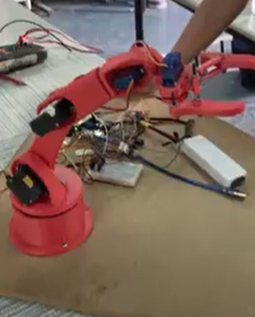

# Robotic_Arm
 

# 
As part of my end-of-year project, I chose to work on this theme,
which we found quite interesting, as it offers us an excellent opportunity to
implement all the skills I have acquired up to this point in our training in robotics and mechatronics and image processing/industrial vision.
I am also interested in the industrial context of this project, which offers us an opportunity to manipulate robots in their exact operating environments and to take all these conditions into account from the the design phase.
# Mechanical design

# 
I have opted for a design that allows us to 3D print the prototype in the right dimensions and
the prototype in the right size and with the right function.
For the mechanical design, I worked on SolidWorks, for the realization of the components as well as their assembly. 
#Impression 3D

#  

